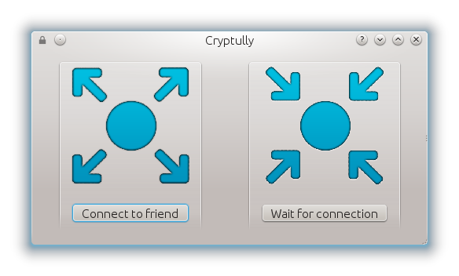
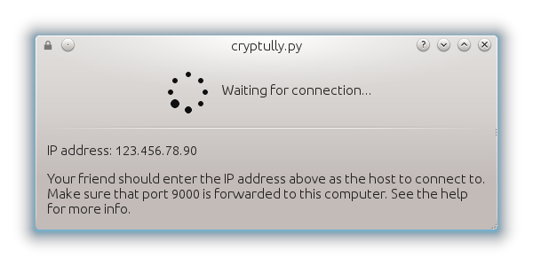
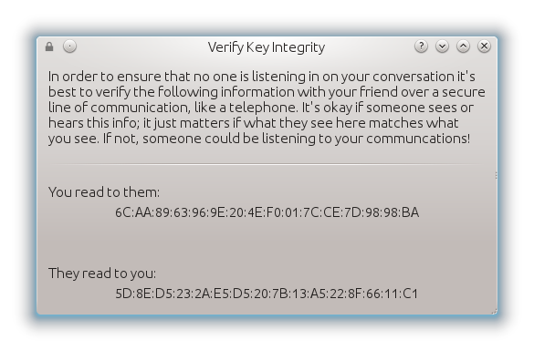

.. _using-|project|:

Using |project|
===============

-----------------
Getting |project|
-----------------

The first step is downloading |project|. To do that, head over to the :ref:`downloads` page. |project| is
available for Linux, Windows, and OS X. Just download the file and run it. No need to install anything
or create any accounts.

----------------------
Connecting to a friend
----------------------

|project| uses what's called a client-server model where one person (the client) connects directly
to the other person's computer (the server). This is different from most other chat server where
both people (clients) connect to a central server.

Let's run through the process of connecting with a friend.

1. When you first open |project|, you'll see the following screen:

2. Person A should select "Wait for connection". The following waiting dialog shows up. This dialog
   contains the public IP address of the computer. An IP address is like a street address for your
   computer; it is a unique identifer for it on the Internet. **Note:** You'll probably need to port
   forward port 9000 on your router so that your friend can connect to your computer. See the port
   forwarding section below.

3. Person B should select "Connect to friend". The following prompt is shown:

4. Person A then tells Person B the IP address that is shown in the waiting dialog. Person B enters
   that in the prompt.

5. If the connection was succesful, person A will see a dialog asking to accept or reject the connection.

.. image:: images/accept_dialog.png

6. Upon accepting the connection, person A and person B are chatting securely!

.. image:: images/chatting.png

**But**, after connecting, you should always verify encrytion key integrity of the person you're
chatting with to ensure no one is listening in on your conversation. See the
:ref:`verifying-encryption-key-integrity` section below.

.. _port-forwarding:

---------------
Port Forwarding
---------------

If you connect to a WiFi network or otherwise connect to the Internet through a router you most likely
need to set up port forwarding before anyone can connect to you. This is the annoying part of having
someone connect directly to your computer.

First, what is a port? A port is simple a number between 1 and about 65,000 that an app on your
computer uses to talk to apps on other computers. From the Internet, all the computers on a home
WiFi network appear as one IP address so when someone connects to that IP, your router needs to know
what computer to send that connection to. This is called forwarding a port to a certain computer.

In |project|'s case, the person that is going to wait for a connection from a friend needs to port
forward port 9000 to their computer. Unfortunately, setting up port forwarding is different for each
brand of router. The best way to do this is to search for a guide on Google about how to port forward
on your specific model of router.

If two people are on the same local network (connected to the same WiFi network) none of this is
necessary and they can just connect directly to the local IP of the computer. Granted, there's not much
use for an encrypted chat program if two people are in the same physcial location.

.. _verifying-encryption-key-integrity:

----------------------------------
Verifying encryption key integrity
----------------------------------

A common attack against encryption is called the man-in-the-middle attack. To protect against
this, it is highly recommended to verify the integrity of the encryption keys of the person you're
chatting with. Fortunately, this is very simple.

First, let's understand what a fingerprint is. Encryption keys look very long to humans. In order to
make them more managable, we create a fingerprint of a key by doing some fancy math that takes a long
input and creates a short sequence of letters and numbers. Like a human's fingerprint, an encryption
key's fingerprint is unique and a good way of proving that you are chatting with who you think you're
chatting with.

1. Select the ``Verify key integrity`` option from the options menu.

.. image:: images/options_menu.png

2. You and your friend need to exchange the sequence of numbers and letters under the
   "You read to them" heading. These are the key fingerprints. A good way of doing this is over the
   phone so you can verify the voice of your friend. Other options include text message or email
   (but telephone is preferred if possible) or even in person if you want to chat at some later time.

3. If both fingerprints match, you're chatting securely! If not, someone is likely listening to your
   communcations and you should disconnect immediately.

**Note:** You should verify the identity of your friend every time you connect to him/her since
a new encryption key is generated each time the application is started, the fingerprints you
exchanged will change. You can avoid this by saving the encryption keys where it is then
only necessary to exchange this info once, but you should still make sure that the "they read to you"
section is the same for all subsequent connections. See the :ref:`saving-encryption-keys` section below.

.. _saving-encryption-keys:

----------------------
Saving encryption keys
----------------------

By default, |project| generates new encryption keys each time it is started. This means you should
exchange fingerprints in the verifying key integrity process described above. However, if you save
your encryption keys, your fingerprint won't change so you only need to exchange fingerprints once
and then you can check that the fingerprints you exchanged matches for all new connections.

To save your encryption keys:

1. You and your friend should go through the verification of encryption key integrity as described
   in the above section.
2. Save (or write down) the sequence from the "they read to you" part of the integriy verification
   process.
3. Both you and your friend save your keys by selecting the "Save keys" option in the option menu.
4. Your encryption keys are secret things. To protect them, |project| will encrypt the encryption
   keys (yes, it sounds weird, but it's safe!). Enter a passphrase to protect them. You'll need
   this the each time you start |project| now.
5. Each subsequent time you connect to your friend, you can now verify the fingerprint in the "they
   read to you section" with the one you originally exchanged with them.

If you ever want to generate new encryption keys, just select "Clear keys" from the options menu.

-------------------------------
Command Line Options (advanced)
-------------------------------

Advanced users may utilize command line options of |project|::

  usage: cryptully-linux [-h] [-p [PORT]] [-s] [-c] [-n] [host]

  positional arguments:
    host                  The host to connect to (if client)

  optional arguments:
    -h, --help            show this help message and exit
    -p [PORT], --port [PORT]
                          Port to connect listen on (server) or connect to
                          (client).
    -s, --server          Run as server.
    -c, --client          Run as client.
    -n, --ncurses         Use the NCurses UI.
