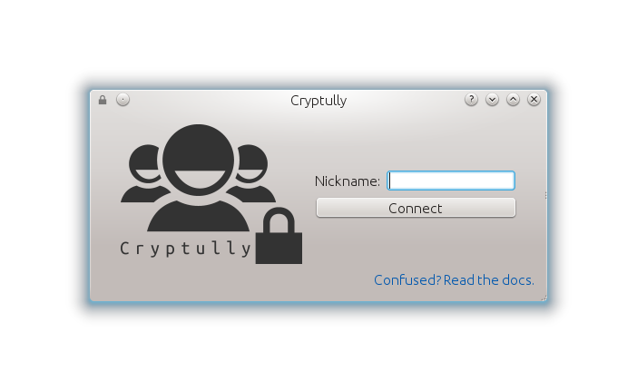
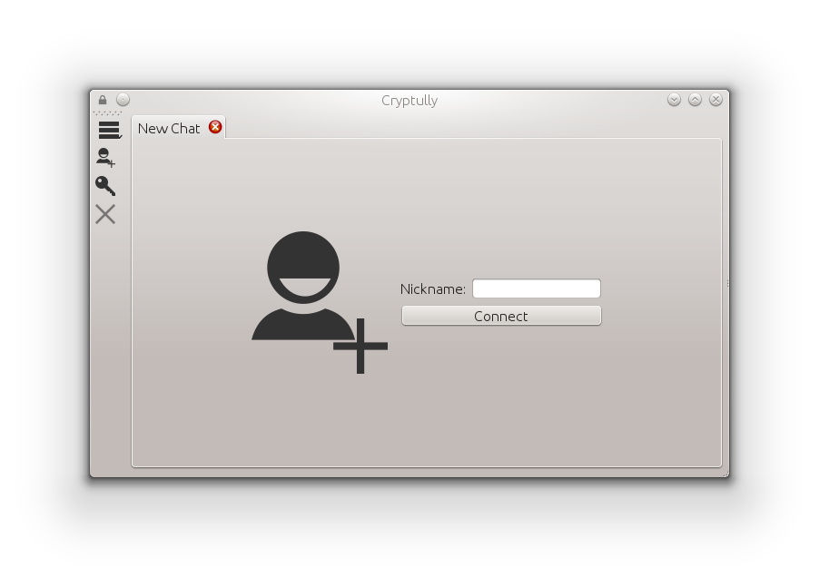
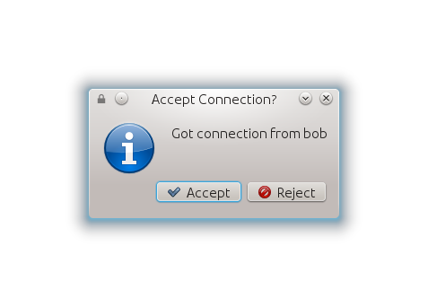
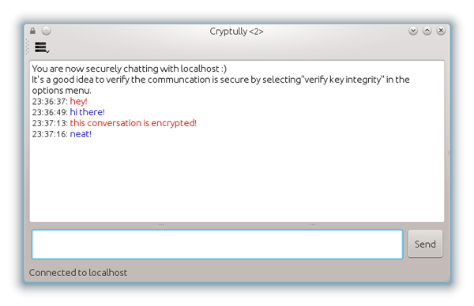
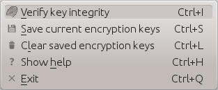
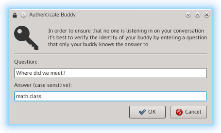
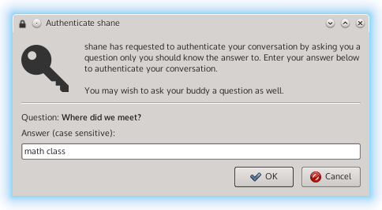
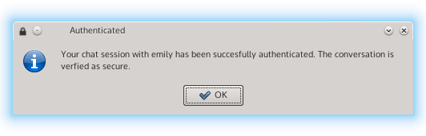

.. _using-|project|:

Using |project|
===============

-----------------
Getting |project|
-----------------

The first step is downloading |project|. To do that, head over to the :ref:`downloads` page. |project| is
available for Linux, Windows, and OS X. Just download the file and run it. No need to install anything
or create any accounts.

----------------------
Connecting to a friend
----------------------

|project| uses a central server to relay messages from one person to another.

Let's run through the process of connecting with a friend.

1. When you first open |project|, you'll see the following screen:

2. Pick a nickname that will identify you to other people you'll chat with.

3. Once connected to the server, you may enter the nickname of someone you wish to chat with.

4. If the connection was successful, the person being connected to will see a dialog asking to accept
   or reject the connection.

5. Upon accepting the connection, both people are chatting securely!

-------------------
Chat Authentication
-------------------

In order to verify the person you're chatting with is not an impersonator and that no one is
eavesdropping on your conversation, |project| uses a secret question and answer method.

To authenticate a chat session:

1. When chatting, select "Authenticate Chat" from the options menu.

2. Enter a question and answer that only you are your buddy knows the answer to. Note that the answer is case sensitive.

3. Your buddy will then have a window open that allows the answer to the given question to be entered.

4. If your buddy entered the same answer as you, the chat will be successfully authenticated. A failure to
   authenticate means either the wrong answer was entered or someone is listening in on your conversation.

-------------------------------
Command Line Options (advanced)
-------------------------------

Advanced users may utilize command line options of |project|:

  usage: cryptully.py [-h] [-k [NICK]] [-r [TURN]] [-p [PORT]] [-s] [-n]

  optional arguments:
    -h, --help            show this help message and exit
    -k [NICK], --nick [NICK]
                          Nickname to use.
    -r [TURN], --relay [TURN]
                          The relay server to use.
    -p [PORT], --port [PORT]
                          Port to connect listen on (server) or connect to
                          (client).
    -s, --server          Run as TURN server for other clients.
    -n, --ncurses         Use the NCurses UI.

----------------------------------
Running Your Own Server (advanced)
----------------------------------

If you don't want to use the default relay server, you can host your own.

This is as easy as downloading a pre-built binary, or getting the source and running |project| with
the ``--server`` command line argument.
